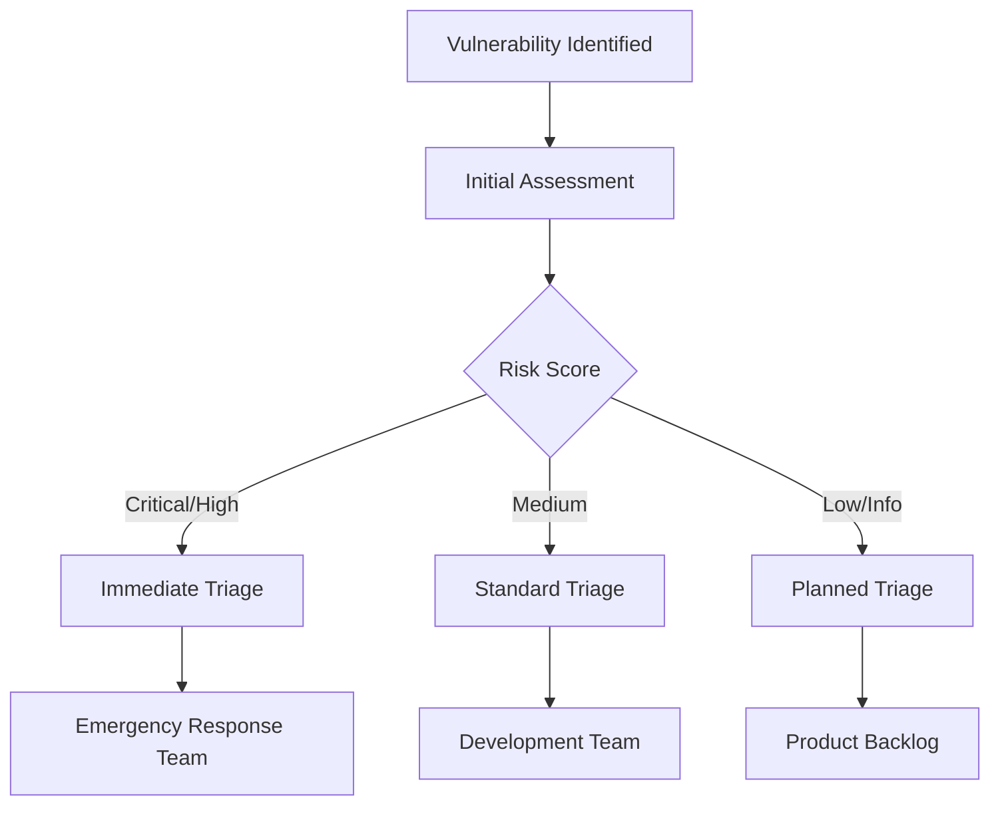

# Security Audit and Penetration Testing Plan

## Overview

This document outlines the comprehensive security audit and penetration testing plan for the Flight Companion Platform, designed to be executed in collaboration with a third-party security firm to ensure enterprise-grade security before production launch.

## Table of Contents

1. [Executive Summary](#executive-summary)
2. [Scope and Objectives](#scope-and-objectives)
3. [Pre-Audit Preparation](#pre-audit-preparation)
4. [Security Assessment Framework](#security-assessment-framework)
5. [Penetration Testing Methodology](#penetration-testing-methodology)
6. [Compliance Requirements](#compliance-requirements)
7. [Risk Assessment Matrix](#risk-assessment-matrix)
8. [Remediation Process](#remediation-process)
9. [Third-Party Firm Requirements](#third-party-firm-requirements)
10. [Timeline and Deliverables](#timeline-and-deliverables)

## Executive Summary

The Flight Companion Platform handles sensitive user data, payment transactions, and personal communications, making comprehensive security testing critical before production deployment. This security audit encompasses application security, infrastructure security, data protection, and compliance validation.

### Key Security Concerns
- Payment processing and escrow system security
- User identity verification and data protection
- Real-time communication security
- Azure cloud infrastructure security
- API security and access controls
- Mobile and web application security

## Scope and Objectives

### In-Scope Components

#### Application Layer
- **Frontend Applications**
  - React TypeScript web application
  - Mobile-responsive interfaces
  - Authentication and session management
  - Payment processing interfaces
  - File upload functionality

- **Backend Services**
  - .NET 8 Web API
  - RESTful API endpoints
  - SignalR real-time communication
  - Authentication and authorization
  - Data validation and sanitization

- **Database Layer**
  - Azure SQL Database
  - Entity Framework Core data access
  - Stored procedures and functions
  - Data encryption and access controls

#### Infrastructure Layer
- **Azure Cloud Services**
  - App Service configuration
  - Application Gateway and WAF
  - Network Security Groups
  - Key Vault secrets management
  - Storage accounts and blob security
  - Application Insights logging

- **Network Security**
  - Virtual network configuration
  - Private endpoints
  - SSL/TLS configuration
  - DNS security

#### Third-Party Integrations
- **Stripe Payment Processing**
  - API integration security
  - Webhook validation
  - PCI DSS compliance

- **External APIs**
  - Flight information services
  - Email notification services
  - Azure Active Directory integration

### Testing Objectives

#### Primary Objectives
1. **Vulnerability Assessment**: Identify security vulnerabilities across all system components
2. **Penetration Testing**: Simulate real-world attacks to test security controls
3. **Compliance Validation**: Verify adherence to security standards and regulations
4. **Risk Assessment**: Evaluate and prioritize security risks
5. **Security Controls Testing**: Validate effectiveness of implemented security measures

#### Secondary Objectives
1. **Performance Under Attack**: Test system behavior during security incidents
2. **Incident Response**: Validate security monitoring and alerting capabilities
3. **Data Protection**: Verify data encryption and privacy controls
4. **Business Logic Testing**: Test for application-specific vulnerabilities

## Pre-Audit Preparation

### Documentation Package

#### 1. System Architecture Documentation
- **Network Diagrams**: Complete network topology and data flow diagrams
- **Infrastructure Maps**: Azure resource relationships and dependencies
- **Security Architecture**: Security controls and defense-in-depth implementation
- **Data Flow Diagrams**: Sensitive data handling and processing flows

#### 2. Security Policies and Procedures
- **Information Security Policy**: Comprehensive security governance framework
- **Incident Response Plan**: Security incident handling procedures
- **Access Control Policy**: User access management and privilege controls
- **Data Protection Policy**: Data classification and handling procedures

#### 3. Technical Specifications
- **API Documentation**: Complete OpenAPI specifications with security annotations
- **Database Schema**: Entity relationship diagrams and access control models
- **Security Controls Matrix**: Implemented security controls and their effectiveness
- **Configuration Baselines**: Security configuration standards and compliance

#### 4. Previous Security Assessments
- **Internal Security Reviews**: Results from internal security testing
- **Code Review Reports**: Static code analysis and security code review results
- **Vulnerability Scans**: Previous automated security scanning results
- **Compliance Audits**: Any prior compliance assessment results

### Environment Preparation

#### 1. Test Environment Setup
```yaml
# Test Environment Configuration
Environment: security-audit
Purpose: Third-party security testing
Scope: Full production replica
Data: Anonymized production data
Access: Restricted to audit team
Duration: 2-4 weeks
```

#### 2. Access Provisioning
- **Audit Team Accounts**: Separate accounts for security firm personnel
- **Privileged Access**: Administrative access for infrastructure testing
- **Monitoring Access**: Read-only access to logs and monitoring systems
- **Documentation Access**: Secure access to technical documentation

#### 3. Monitoring and Logging Enhancement
```powershell
# Enhanced Audit Logging Configuration
# Enable detailed security audit logging
Set-AzureSecurityAuditLogging -Environment SecurityAudit -DetailLevel Maximum

# Configure real-time security monitoring
Enable-SecurityEventMonitoring -AlertThreshold High -NotificationEmail audit@flightcompanion.com

# Set up dedicated Log Analytics workspace
New-AzLogAnalyticsWorkspace -Name "security-audit-logs" -Location "Australia East"
```

## Security Assessment Framework

### OWASP Testing Framework

#### Web Application Security Testing
Based on OWASP Top 10 2021 and OWASP ASVS 4.0

##### 1. Broken Access Control (A01:2021)
- **Vertical Privilege Escalation**: Test user role elevation attacks
- **Horizontal Privilege Escalation**: Test access to other users' data
- **Directory Traversal**: Test file system access vulnerabilities
- **CORS Misconfiguration**: Test cross-origin resource sharing policies

**Test Cases**:
```javascript
// Example access control test scenarios
const accessControlTests = [
  {
    name: "Admin Panel Access",
    description: "Regular user attempts to access admin endpoints",
    endpoint: "/api/admin/users",
    userRole: "User",
    expectedResult: "403 Forbidden"
  },
  {
    name: "User Data Access",
    description: "User A attempts to access User B's profile",
    endpoint: "/api/users/{userId}",
    scenario: "Cross-user data access",
    expectedResult: "403 Forbidden or 404 Not Found"
  }
];
```

##### 2. Cryptographic Failures (A02:2021)
- **Data in Transit**: TLS configuration and certificate validation
- **Data at Rest**: Database encryption and key management
- **Sensitive Data Exposure**: PII and payment data protection
- **Weak Cryptography**: Algorithm strength and implementation

##### 3. Injection Attacks (A03:2021)
- **SQL Injection**: Database query manipulation
- **NoSQL Injection**: Document database attacks
- **Command Injection**: Operating system command execution
- **LDAP Injection**: Directory service attacks

**Test Vectors**:
```sql
-- SQL Injection Test Patterns
' OR '1'='1
'; DROP TABLE Users; --
' UNION SELECT * FROM CreditCards --
' AND (SELECT COUNT(*) FROM INFORMATION_SCHEMA.TABLES) > 0 --
```

##### 4. Insecure Design (A04:2021)
- **Business Logic Flaws**: Application workflow vulnerabilities
- **Missing Security Controls**: Inadequate security architecture
- **Threat Modeling Gaps**: Unaddressed security threats

##### 5. Security Misconfiguration (A05:2021)
- **Default Credentials**: Unchanged default passwords
- **Unnecessary Features**: Enabled debugging and admin interfaces
- **Error Handling**: Information disclosure in error messages
- **Security Headers**: Missing or misconfigured HTTP security headers

##### 6. Vulnerable Components (A06:2021)
- **Outdated Dependencies**: Known vulnerabilities in third-party libraries
- **Unpatched Software**: Missing security updates
- **Unnecessary Services**: Unused components with security risks

##### 7. Authentication Failures (A07:2021)
- **Weak Passwords**: Password policy enforcement
- **Session Management**: Session fixation and hijacking
- **Multi-Factor Authentication**: MFA bypass attempts
- **Credential Stuffing**: Automated login attacks

##### 8. Software Integrity Failures (A08:2021)
- **Supply Chain Security**: Third-party component integrity
- **Code Signing**: Application integrity verification
- **Update Mechanisms**: Secure software update processes

##### 9. Logging and Monitoring Failures (A09:2021)
- **Security Event Logging**: Adequate security event capture
- **Log Integrity**: Protection against log tampering
- **Incident Detection**: Security incident identification capabilities

##### 10. Server-Side Request Forgery (A10:2021)
- **SSRF Attacks**: Internal system access via server requests
- **URL Validation**: Input validation for URL parameters
- **Network Segmentation**: Internal network protection

### Infrastructure Security Assessment

#### Cloud Security Framework (Azure)
Based on Azure Security Benchmark and CIS Controls

##### 1. Identity and Access Management
- **Azure Active Directory**: Configuration and access policies
- **Service Principals**: Authentication and authorization
- **Managed Identities**: Secure service-to-service authentication
- **Privileged Access**: Administrative access controls

##### 2. Network Security
- **Network Security Groups**: Traffic filtering and access control
- **Application Gateway WAF**: Web application firewall effectiveness
- **Private Endpoints**: Network isolation and secure connectivity
- **DDoS Protection**: Distributed denial of service mitigation

##### 3. Data Protection
- **Encryption at Rest**: Azure SQL and Storage encryption
- **Encryption in Transit**: TLS/SSL configuration
- **Key Management**: Azure Key Vault security
- **Data Classification**: Sensitive data identification and protection

##### 4. Monitoring and Logging
- **Azure Monitor**: Security event monitoring
- **Application Insights**: Application security telemetry
- **Log Analytics**: Security log analysis and retention
- **Security Center**: Threat detection and response

## Penetration Testing Methodology

### Testing Phases

#### Phase 1: Reconnaissance and Information Gathering
**Duration**: 3-5 days
**Objective**: Gather intelligence about the target system

##### External Reconnaissance
- **DNS Enumeration**: Discover subdomains and DNS records
- **Port Scanning**: Identify open ports and services
- **Service Fingerprinting**: Determine service versions and configurations
- **SSL/TLS Analysis**: Certificate and encryption configuration assessment

```bash
# Example reconnaissance commands
nmap -sS -sV -O -A flightcompanion.azurewebsites.net
dig flightcompanion.azurewebsites.net ANY
sslscan flightcompanion.azurewebsites.net:443
```

##### Internal Reconnaissance (Post-Authentication)
- **Application Mapping**: Discover all application endpoints
- **User Enumeration**: Identify user accounts and roles
- **Technology Stack**: Identify frameworks and libraries
- **API Discovery**: Enumerate available API endpoints

#### Phase 2: Vulnerability Assessment
**Duration**: 5-7 days
**Objective**: Identify security vulnerabilities

##### Automated Scanning
- **Web Application Scanning**: OWASP ZAP, Burp Suite, Nessus
- **Infrastructure Scanning**: Nmap, OpenVAS, Azure Security Center
- **Code Analysis**: Static application security testing (SAST)
- **Dependency Scanning**: Known vulnerability identification

##### Manual Testing
- **Business Logic Testing**: Application-specific vulnerability assessment
- **Authentication Testing**: Login mechanism security evaluation
- **Session Management**: Session security and lifecycle testing
- **Input Validation**: Data sanitization and validation testing

#### Phase 3: Exploitation
**Duration**: 7-10 days
**Objective**: Demonstrate impact of identified vulnerabilities

##### Controlled Exploitation
- **Proof of Concept**: Demonstrate vulnerability exploitation
- **Privilege Escalation**: Test for elevated access capabilities
- **Data Access**: Verify unauthorized data access possibilities
- **Lateral Movement**: Test for internal network traversal

##### Impact Assessment
- **Data Breach Simulation**: Test data exfiltration capabilities
- **Service Disruption**: Assess denial of service vulnerabilities
- **Financial Impact**: Evaluate payment system security
- **Reputation Impact**: Assess user trust and privacy implications

#### Phase 4: Post-Exploitation
**Duration**: 2-3 days
**Objective**: Assess long-term compromise implications

##### Persistence Testing
- **Backdoor Creation**: Test for persistent access mechanisms
- **Log Evasion**: Evaluate detection avoidance capabilities
- **Data Modification**: Test for unauthorized data changes
- **System Monitoring**: Assess security monitoring effectiveness

### Testing Tools and Techniques

#### Web Application Testing Tools
```yaml
Primary Tools:
  - Burp Suite Professional: Manual and automated web application testing
  - OWASP ZAP: Open-source security testing proxy
  - SQLmap: Automated SQL injection testing
  - Nmap: Network discovery and security auditing

Secondary Tools:
  - Nikto: Web server scanner
  - Gobuster: Directory and file brute-forcing
  - ffuf: Fast web fuzzer for parameter discovery
  - Sublist3r: Subdomain enumeration tool
```

#### Infrastructure Testing Tools
```yaml
Network Security:
  - Nessus: Comprehensive vulnerability scanner
  - OpenVAS: Open-source vulnerability assessment
  - Masscan: High-speed port scanner
  - SSL Labs: SSL/TLS configuration analysis

Cloud Security:
  - Scout Suite: Multi-cloud security auditing
  - Azure Security Center: Native Azure security assessment
  - Prowler: AWS/Azure security best practices audit
  - CloudMapper: Cloud environment visualization
```

## Compliance Requirements

### Regulatory Compliance

#### 1. Payment Card Industry Data Security Standard (PCI DSS)
**Applicable Requirements**:
- **Requirement 1**: Install and maintain firewall configuration
- **Requirement 2**: Do not use vendor-supplied defaults
- **Requirement 3**: Protect stored cardholder data
- **Requirement 4**: Encrypt transmission of cardholder data
- **Requirement 6**: Develop and maintain secure systems
- **Requirement 8**: Identify and authenticate access
- **Requirement 11**: Regularly test security systems

**Assessment Scope**:
```yaml
PCI DSS Scope:
  Payment Processing:
    - Stripe integration security
    - Payment form data handling
    - Transaction logging and monitoring
  
  Network Security:
    - Segmentation of payment systems
    - Firewall configurations
    - Access control mechanisms
  
  Data Protection:
    - Cardholder data encryption
    - Key management practices
    - Data retention policies
```

#### 2. General Data Protection Regulation (GDPR)
**Applicable Articles**:
- **Article 25**: Data protection by design and by default
- **Article 28**: Processor obligations
- **Article 32**: Security of processing
- **Article 33**: Notification of data breach
- **Article 35**: Data protection impact assessment

#### 3. New Zealand Privacy Act 2020
**Applicable Principles**:
- **Principle 5**: Storage and security of personal information
- **Principle 10**: Limits on use of personal information
- **Principle 11**: Limits on disclosure of personal information
- **Principle 12**: Unique identifiers

### Industry Standards

#### 1. OWASP Application Security Verification Standard (ASVS) 4.0
**Verification Levels**:
- **Level 1**: Opportunistic security verification
- **Level 2**: Standard security verification (Target Level)
- **Level 3**: Advanced security verification

#### 2. NIST Cybersecurity Framework
**Core Functions**:
- **Identify**: Asset management and risk assessment
- **Protect**: Access control and data security
- **Detect**: Security monitoring and anomaly detection
- **Respond**: Incident response and communication
- **Recover**: Recovery planning and improvements

## Risk Assessment Matrix

### Risk Calculation Methodology

#### Risk Score = Likelihood × Impact × Exploitability

##### Likelihood Scale (1-5)
1. **Very Low**: Theoretical vulnerability, no known exploit
2. **Low**: Difficult to exploit, requires specific conditions
3. **Medium**: Moderately difficult to exploit
4. **High**: Easy to exploit with common tools
5. **Very High**: Trivial to exploit, automated exploitation possible

##### Impact Scale (1-5)
1. **Very Low**: Minimal business impact
2. **Low**: Limited impact to specific users
3. **Medium**: Moderate impact to business operations
4. **High**: Significant impact to business or users
5. **Very High**: Severe impact, potential business closure

##### Exploitability Scale (1-5)
1. **Very Low**: Requires deep technical expertise
2. **Low**: Requires specialized tools or knowledge
3. **Medium**: Script kiddie level exploitation
4. **High**: Public exploits available
5. **Very High**: Point-and-click exploitation tools

### Risk Categories

#### Critical Risk (Score: 20-25)
- **Immediate Action Required**: Must be fixed before production launch
- **Examples**: SQL injection allowing data theft, authentication bypass
- **Timeline**: Fix within 24-48 hours

#### High Risk (Score: 15-19)
- **Urgent Action Required**: Must be fixed within 1 week
- **Examples**: Cross-site scripting, privilege escalation
- **Timeline**: Fix within 1 week

#### Medium Risk (Score: 10-14)
- **Action Required**: Must be fixed within 2 weeks
- **Examples**: Information disclosure, weak authentication
- **Timeline**: Fix within 2 weeks

#### Low Risk (Score: 5-9)
- **Monitor and Plan**: Address in next development cycle
- **Examples**: Missing security headers, verbose error messages
- **Timeline**: Fix within 1 month

#### Informational (Score: 1-4)
- **Best Practice**: Consider for future improvements
- **Examples**: Security configuration recommendations
- **Timeline**: Consider for future releases

## Remediation Process

### Vulnerability Management Workflow

#### 1. Vulnerability Identification and Triage


#### 2. Remediation Planning
- **Root Cause Analysis**: Identify underlying security weaknesses
- **Fix Development**: Create secure code fixes and patches
- **Testing Strategy**: Validate fix effectiveness and regression testing
- **Deployment Plan**: Coordinate fix deployment with minimal disruption

#### 3. Validation and Verification
- **Fix Verification**: Confirm vulnerability remediation
- **Regression Testing**: Ensure fixes don't introduce new vulnerabilities
- **Re-testing**: Independent verification by security firm
- **Sign-off**: Security team approval for remediation closure

### Remediation Timeline

#### Critical and High-Risk Vulnerabilities
```yaml
Timeline: 1-7 days
Process:
  Day 0: Vulnerability reported and confirmed
  Day 1: Emergency response team assembled
  Day 2-4: Fix development and internal testing
  Day 5-6: Fix deployment and validation
  Day 7: Re-testing and sign-off

Communication:
  - Immediate notification to executive team
  - Daily status updates to stakeholders
  - Public disclosure consideration (if applicable)
```

#### Medium and Low-Risk Vulnerabilities
```yaml
Timeline: 2-4 weeks
Process:
  Week 1: Vulnerability analysis and fix planning
  Week 2-3: Fix development and testing
  Week 4: Deployment and validation

Communication:
  - Weekly status updates
  - Regular stakeholder communication
  - Documentation updates
```

## Third-Party Firm Requirements

### Vendor Selection Criteria

#### 1. Certifications and Qualifications
**Required Certifications**:
- **CREST**: Council of Registered Ethical Security Testers
- **OSCP**: Offensive Security Certified Professional
- **CEH**: Certified Ethical Hacker
- **CISSP**: Certified Information Systems Security Professional

**Experience Requirements**:
- Minimum 5 years in application security testing
- Proven experience with cloud infrastructure (Azure preferred)
- Payment system security testing experience
- Web application and API security expertise

#### 2. Methodology and Standards
**Testing Standards**:
- OWASP Testing Guide compliance
- NIST SP 800-115 technical guide adherence
- PTES (Penetration Testing Execution Standard) methodology
- Custom methodology documentation

**Reporting Standards**:
- Executive summary with business impact
- Technical findings with CVSS scoring
- Detailed reproduction steps
- Remediation recommendations with timelines

#### 3. Tools and Capabilities
**Required Tools**:
- Commercial web application scanners (Burp Suite Pro, etc.)
- Network vulnerability scanners (Nessus, OpenVAS)
- Cloud security assessment tools
- Custom exploit development capabilities

**Infrastructure Requirements**:
- Dedicated testing infrastructure
- Secure communication channels
- Encrypted data storage and transmission
- Non-disclosure agreement compliance

### Engagement Model

#### 1. Hybrid Testing Approach
```yaml
Testing Model: Hybrid (Black-box + Gray-box + White-box)

Black-box Testing:
  - External perspective simulation
  - No prior system knowledge
  - Real attacker simulation
  Duration: 30% of engagement

Gray-box Testing:
  - Limited system knowledge
  - User-level access provided
  - Authenticated attack simulation
  Duration: 40% of engagement

White-box Testing:
  - Full system documentation access
  - Source code review
  - Architecture analysis
  Duration: 30% of engagement
```

#### 2. Communication Protocol
- **Daily Stand-ups**: Progress updates and issue identification
- **Weekly Reports**: Detailed findings and recommendations
- **Emergency Escalation**: Critical vulnerability immediate notification
- **Final Presentation**: Executive briefing and remediation roadmap

### Deliverables and Reporting

#### 1. Executive Summary Report
```yaml
Content:
  - Business risk assessment
  - Security posture overview
  - Compliance status summary
  - Investment recommendations
  - Strategic security roadmap

Audience: C-level executives, board members
Format: PowerPoint presentation + PDF summary
Timeline: Final day of engagement
```

#### 2. Technical Findings Report
```yaml
Content:
  - Detailed vulnerability descriptions
  - CVSS scoring and risk ratings
  - Proof-of-concept exploits
  - Remediation procedures
  - Code-level recommendations

Audience: Development and security teams
Format: Comprehensive PDF report
Timeline: 5 business days after testing completion
```

#### 3. Compliance Assessment Report
```yaml
Content:
  - PCI DSS compliance status
  - GDPR compliance evaluation
  - Industry standard adherence
  - Regulatory risk assessment
  - Compliance roadmap

Audience: Compliance and legal teams
Format: Structured compliance matrix
Timeline: 3 business days after testing completion
```

## Timeline and Deliverables

### Engagement Timeline

#### Pre-Engagement Phase (2 weeks)
**Week 1: Preparation and Planning**
- Contract negotiation and SOW finalization
- NDA execution and legal documentation
- Technical scoping and environment setup
- Documentation package delivery

**Week 2: Environment Setup**
- Test environment provisioning
- Access credential creation
- Monitoring and logging configuration
- Kick-off meeting and final planning

#### Engagement Phase (4 weeks)

**Week 1: Reconnaissance and Assessment**
- External reconnaissance and intelligence gathering
- Automated vulnerability scanning
- Initial manual testing and validation
- Preliminary findings documentation

**Week 2: Deep Dive Testing**
- Manual penetration testing
- Business logic vulnerability assessment
- Authentication and authorization testing
- Infrastructure security evaluation

**Week 3: Exploitation and Impact Assessment**
- Controlled exploitation of identified vulnerabilities
- Privilege escalation and lateral movement testing
- Data access and exfiltration simulation
- Impact assessment and risk calculation

**Week 4: Validation and Reporting**
- Findings validation and confirmation
- False positive elimination
- Report writing and documentation
- Remediation recommendation development

#### Post-Engagement Phase (2 weeks)

**Week 1: Report Delivery and Presentation**
- Draft report delivery and review
- Technical findings presentation
- Executive briefing and business impact discussion
- Remediation planning and prioritization

**Week 2: Follow-up and Closure**
- Final report delivery with incorporated feedback
- Remediation timeline establishment
- Retesting scope and schedule definition
- Project closure and lessons learned

### Key Milestones and Deliverables

```yaml
Milestone 1 (Week 1): Initial Assessment Complete
Deliverables:
  - Preliminary findings summary
  - Critical vulnerability alert (if any)
  - Testing progress report

Milestone 2 (Week 2): Deep Dive Testing Complete
Deliverables:
  - Intermediate findings report
  - Risk assessment preliminary results
  - Remediation priority matrix

Milestone 3 (Week 3): Exploitation Testing Complete
Deliverables:
  - Impact assessment report
  - Business risk evaluation
  - Emergency remediation requirements

Milestone 4 (Week 4): Final Testing Complete
Deliverables:
  - Complete technical findings
  - Executive summary draft
  - Remediation roadmap

Milestone 5 (Week 5): Report Delivery
Deliverables:
  - Executive summary report
  - Technical findings report
  - Compliance assessment report
  - Remediation guidelines

Milestone 6 (Week 6): Project Closure
Deliverables:
  - Final report with feedback incorporation
  - Retesting plan and scope
  - Security improvement roadmap
  - Project closure documentation
```

### Success Criteria

#### Primary Success Criteria
1. **Complete Security Assessment**: All in-scope components thoroughly tested
2. **Vulnerability Identification**: All security vulnerabilities documented and rated
3. **Compliance Validation**: Regulatory compliance status clearly established
4. **Actionable Recommendations**: Clear remediation guidance provided
5. **Executive Understanding**: Business impact clearly communicated

#### Secondary Success Criteria
1. **Team Knowledge Transfer**: Internal team educated on findings
2. **Process Improvement**: Security testing process enhancement
3. **Tool Recommendations**: Security tooling gaps identified
4. **Future Planning**: Long-term security strategy development
5. **Incident Response**: Security incident handling capability validation

### Quality Assurance

#### Report Quality Standards
- **Accuracy**: All findings verified and reproducible
- **Completeness**: Comprehensive coverage of all requirements
- **Clarity**: Clear and understandable recommendations
- **Timeliness**: Delivery within agreed timelines
- **Actionability**: Practical and implementable recommendations

#### Testing Quality Standards
- **Thoroughness**: Comprehensive testing methodology application
- **Professionalism**: Minimal business operation disruption
- **Documentation**: Detailed testing evidence and proof-of-concepts
- **Communication**: Regular updates and immediate critical issue reporting
- **Compliance**: Adherence to agreed testing scope and limitations

## Conclusion

This comprehensive security audit and penetration testing plan provides the framework for engaging with a qualified third-party security firm to thoroughly assess the Flight Companion Platform's security posture. The plan ensures:

1. **Complete Coverage**: All critical system components and security domains
2. **Professional Standards**: Industry-recognized methodologies and standards
3. **Actionable Results**: Clear prioritization and remediation guidance
4. **Compliance Validation**: Regulatory and industry standard adherence
5. **Business Value**: Security investment aligned with business objectives

The successful execution of this security audit will provide confidence in the platform's security before production launch and establish a foundation for ongoing security assurance programs.
